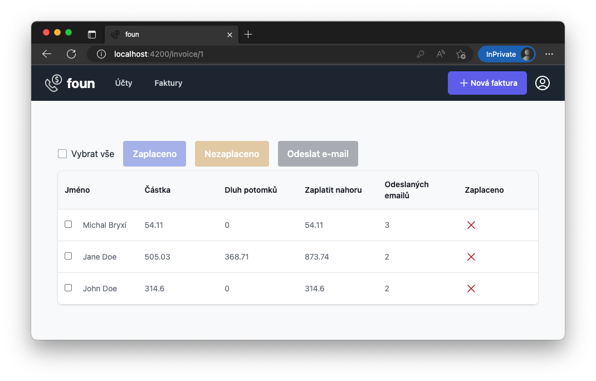

# foun

Automated invoice splitting for Czech phone carrier operators.



## Backend

All the commands below assume:

```sh
cd backend
```

### Installation

To be able to run commands like `rails c` locally:
```sh
brew install rbenv
rbenv init
gem install ffi -v '1.9.21' -- --with-cflags="-Wno-error=implicit-function-declaration"
bundle
```

Backend & database are running inside a docker image:

```sh
docker-compose build
```

### Running

```sh
docker-compose up
```

To populate the database:
```sh
rails db:reset
```

## Frontend

All the commands below assume:

```sh
cd ui/frontend
```

### Installation

For node/yarn version management the project uses [volta](https://volta.sh/):

```sh
brew install volta
```

### Running

```sh
yarn start
```

Application appears on [http://localhost:4200/](http://localhost:4200/).

## Production

Hosted on [railway](https://railway.app/)

### Installation

```sh
brew install railwayapp/tap/nixpacks
brew install railway
brew login
```

### Database seed

```sh
railway shell
# select "backend"
> rails db:reset
```

### Manual deployment of frontend

```sh
API_HOST='https://foun-api.pudr.com' NETLIFY_SITE_ID='xxx' NETLIFY_AUTH_TOKEN='yyy' ember deploy production
```