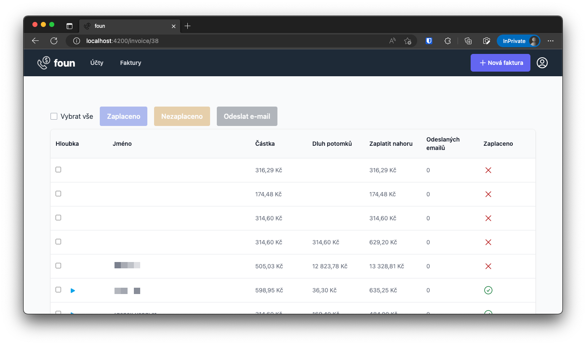
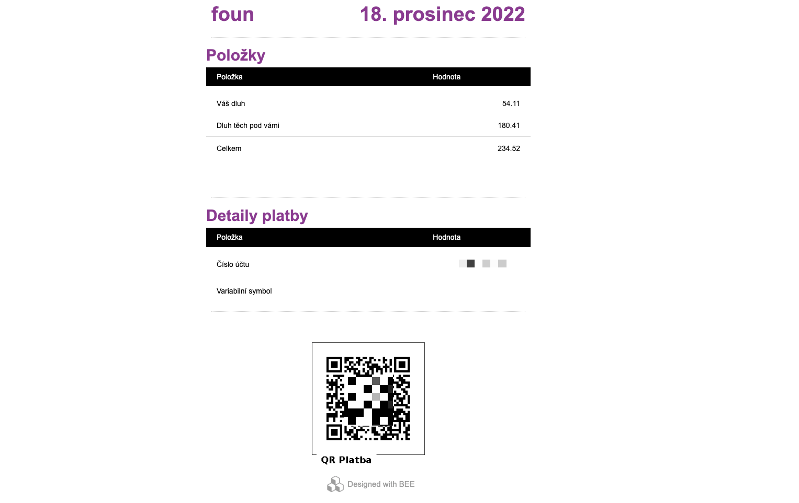

# foun

Automated invoice splitting for Czech phone carrier operators.


## Backend

All the commands below assume:

```sh
cd backend
```

### Installation

#### Local rails

To be able to run commands like `rails c` locally:
```sh
brew install rbenv
rbenv init
gem install ffi -v '1.9.21' -- --with-cflags="-Wno-error=implicit-function-declaration"
bundle
```

#### Mailcatcher

```sh
brew install mailcatcher
brew services restart mailcatcher
```

And then go to: [http://127.0.0.1:1080/](http://127.0.0.1:1080/)

Backend & database are running inside a docker image:

```sh
docker-compose build
```

### Running

```sh
docker-compose up
```

To populate the database:
```sh
rails db:reset
```

## Frontend

All the commands below assume:

```sh
cd ui/frontend
```

### Installation

For node/yarn version management the project uses [volta](https://volta.sh/):

```sh
brew install volta
```

### Running

```sh
yarn start
```

Application appears on [http://localhost:4200/](http://localhost:4200/).

## Production

Hosted on [railway](https://railway.app/)

### Installation

```sh
brew install railwayapp/tap/nixpacks
brew install railway
railway login
```

### Database seed

```sh
railway shell
# select "backend"
> rails db:reset
```

## Mailing

### Mailing service

- We use [Mailgun](https://app.mailgun.com/)

### Mailing templates

- For templates we use [befree](https://pro.beefree.io/)
- Because `befree` does not allow erb tags (`<%=` and `%>`) we need to do some replacements:
  - Find `{{`, replace with: `<%=`
  - Find `}}`, replace with: `%>`

### ENV variables

```sh
RAILS_ENV=production # to build production version of the app
SECRET_KEY_BASE=xxx  # verify the integrity of signed cookies
MAILGUN_API_KEY=xxx  # Mailgun API key
PGDATABASE=xxx       # PostgreSQL db
PGUSER=xxx           # PostgreSQL user
PGPASSWORD=xxx       # PostgreSQL password
PGHOST=xxx           # PostgreSQL host
```

## Screenshots

### Accounts screen


### Invoice import screen


### Invoice details screen


### Notification email
